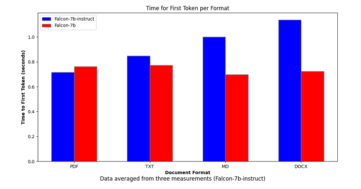
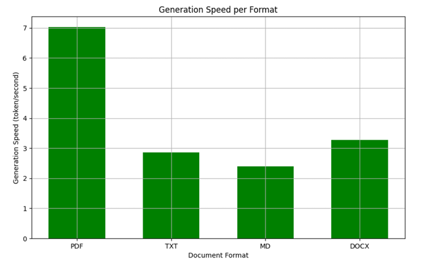
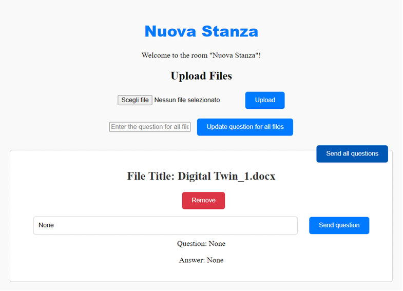

# 📄 DocumentDigitalTwin

**A collaborative web platform to query and interact with documents using Large Language Models (LLMs)**  
Developed as part of my MSc thesis in Computer Engineering at Politecnico di Bari.

---

## 🧠 Key Features

- 🔍 Natural language querying of uploaded documents using Hugging Face LLMs (Falcon, Mistral)
- 👥 Multi-user "rooms" for shared document interaction and persistent chat context
- 📂 Supports multiple formats: PDF, DOCX, TXT, PPTX, Markdown
- 💬 Q&A based on document context (semantic search + summarization)
- 📊 Integrated performance analysis by format, question length, and generation speed
- 🔐 Document isolation per room for secure interaction

---

## 🛠️ Tech Stack

| Layer       | Technologies                         |
|-------------|--------------------------------------|
| Backend     | Flask, SQLAlchemy, SQLite            |
| Frontend    | HTML, CSS (Jinja2 templates)         |
| LLM Engine  | Hugging Face Transformers            |
| Parsing     | PyPDF2, python-docx, python-pptx, markdown2 |
| ML / NLP    | Transformers, Torch, Scikit-learn    |
| Deployment  | Docker-ready structure (WIP)         |

---

## 🚀 Getting Started

### 1. Clone the repo

```bash
git clone https://github.com/IvanMaddalena/DocumentDigitalTwin.git
cd DocumentDigitalTwin
```

### 2. Create and activate virtual environment

```bash
python -m venv venv
source venv/bin/activate        # On Windows: venv\Scripts\activate
```

### 3. Install dependencies

```bash
pip install -r requirements.txt
```

### 4. Run the application

```bash
python app.py
```

## 📊 Performance Results

⏱️ First Token Generation Time



⚡ Generation Speed per Format



🖥️ UI Screenshot - Room Interface



## 📂 Project Structure

```plaintext
DocumentDigitalTwin/
├── app.py
├── templates/
├── static/
├── uploads/
├── instance/
├── docs/
├── requirements.txt
├── .gitignore
└── README.md
```

## 🎓 Academic Context

This project was developed as part of my MSc thesis titled:
"Digital Twin Generation for Documents Using Large Language Models"

Presented at: Politecnico di Bari, Department of Computer Engineering

Year: 2024–2025

## 📬 Contact

👤 Ivan Maddalena

📫 Email: ivan.maddalena00@gmail.com

